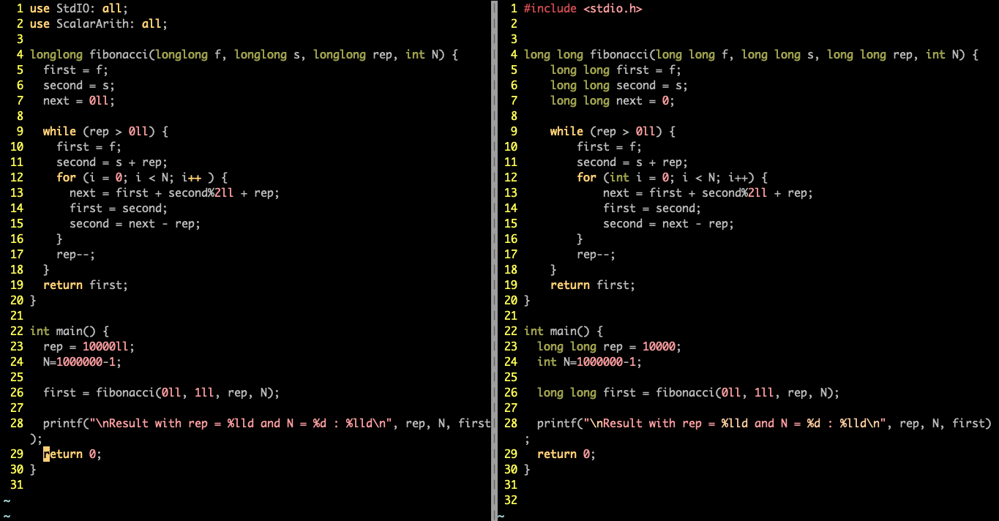

# A series of posts on SaC performance and use for physics and applied maths

_Abstract_

> SaC, an array oriented functional programming language, surprisingly _crushes_ gcc/clang on a
> simpletonish Fibonacci-like µbenchmark. We thus investigate the reasons for that, and it turns out
> that side-effects and term rewriting play a large role there. And I won’t tell you more because
> it’s not really an abstract.

I discovered the [SaC programming language](https://www.sac-home.org/doku.php) on january 20th 2022.
I had a shock. Coming from Matlab, Julia, Python and C/C++ I had _never_ heard of SaC, yet it has
all the features I want for my needs in scientific computations, and good expressivity, especially
with its `with` loop. It has both an industrial look, together with the FP smoothness, you know,
this academic texture. So it’s built by academics for engineering purposes. But SaC is quasi-absent
from the web outside of its academic den. I saw a reference there from 2011 stating SaC was “state
of the art”.

I thus had the idea of a series of posts around SaC benchmarks, and will write them with the help of
Sven-Bodo Scholz (hereafter SBS): he helps me figure out what SaC is doing (also what I’m doing) and
I write about what I do and what I think about all that. Then SBS can say what he thinks about my
interpretation. So it is a very open-minded series, where an end-user with no serious CS background,
like me, is exploring the possibilities offered by SaC compared to other languages. So I’ll just say
what I think about all that, and everything I say about SaC is checked by SBS, so he might (not)
agree with the rest (you’ll have to guess !) and of course many other will definitely not agree, and
that’s what makes the whole series interesting too : have people discover SaC, see it’s wondrous and
surprisingly unknown power, and start using it, and have others teach me where I’m wrong and why
they chose not to use SaC because of course they have thought deeply about that.

This series is a screenshot of my current reflection, i.e. a thoughtshot, which of course can evolve
as other people enlighten me. It is thus an informed (thanks to SBS) yet biassed (thanks to me)
series. I like to state clearly what I think so that others can easily concur with me or debunk me,
I’m not trying to be nice, nor actually trying to be mean.

## What’s my goal in this post ?

In this first post on the SaC language for hardcore scientists, I will present a very simple code
with _surprising_ results. Everyone knows the Fibonacci sequence, and many use it as a µbenchmark
when they look at a new language they want to explore. Now in order to compare SaC with gcc/clang I
wrote a modified Fibonacci that tries to lengthen the computation by making apparent modifications
which in fact are not modifications in the end : they’re meant to slow things down but not change
anything to the final result. We thus test the capacity of the compiler to help humans deal with
what they're not really good at, i.e. repetitive and automatic tasks. So I don’t want a compiler to
_just_ translate the code to another language, I want it also to work for me and elide my stupidity
wherever possible.

## About µbenchmarks

In general, people have a love & hate relationship with µbenchmarks : they like it as long as
they're favorable to their beloved language, and when it is not the case they find all kinds of
excuses like "Oh, µbenchmarks are not interesting because they don't generalize to the situation
encountered with more complex code where the timing depends on tons of other factors." Yes indeed,
_sometimes_, but first we don't denigrate 100m sprinters because their performance doesn’t
generalize to a marathon, and second :

1. In a complex code, there might be gullets which perfectly fit the µbenchmark situation.
2. We don't always write complex applications : statistically, most are short, just look at the
   statistics of github which itself over-represents longer bigger codebases because who want to
   push simple stuff and exhibit those to the public eye ?
3. I'm a reductionist, and I believe that global performance is achieved by local performance, and I
   wouldn't trust someone telling me that “yes, this pillar is indeed weak, but once there will be a
   bunch packed together with a roof over your head it'll be fine, because then pillars don’t matter
   anymore, I can assure you, trust me”. Nope.

It is also true that my code would be easy to correct by an average coder, but that's the point :
why doesn't the compiler see what is obvious ?  If a compiler cannot help me solve trivial problems,
how can I expect it to help me solve anything complex ?

If a computer miscalculates the sum of the first `n` integers, and someone answers "well, it's not
interesting because the result is `n(n+1)/2` then I totally disagree. It is indeed in those rare
occasions where a human knows the result that it is interesting to see how a computer finds his way
through the (trivial) maze.

For more on µbenchmarks, you're better off reading from of the masters directly, Daniel Lemire,
who's got a very [well thought approach to the
field](https://lemire.me/blog/2018/01/16/microbenchmarking-calls-for-idealized-conditions/).

## SaC's opinionated approach to scientific computing

Now with regards to time spent coding, should the coder spend time optimizing everything ? If so,
what path is he to take among all possibilities ? And what about safety ? And should he optimize the
worse case, the best case, or the mean, or… Here, SBS tells us SaC's philosophy is :

> SaC is built on the idea that the programmer should have as little control over the HW choices as
> possible making programs better portable to different / new architectures.

SaC thus is closer to what scientists typically want to do with a language, i.e. focus on the maths
and let the language deal with the rest. But then scientists (I mean physicists, applied maths,
etc.) accept to abandon every possible control to the compiler. This is exactly what I have
experienced with Matlab, Mathematica, and many others. The difference with SaC is that it offers
some kind of formal optimization possibilities (term rewriting) in the world of numeric, and allows
one to escape the appalling slowness of standard mathematical platforms while allowing a new
approach to expressivity, something we'll see in later posts... Ok, ok, here’s an appetiser : SaC
has recently topped it’s standard powerful syntax with some new sugar for tensor operations tailored
to the use of physicists et al. like me.

SaC just doesn't compile locally : it needs to see the _whole_ code, with all the imports, in order
to perform maximally. This means that the _imports_ are in fact _includes_ ! And this also explains
why, with the default flags, the compiler seems darn slow. I mean, real slow, like Rust slow, yes,
sorry. But contrary to Julia, it doesn't preload the BLAS library before running your `hello world`
just in case you might also want to find the eigenvalues of a hamiltonian while saluting. Yes I
know, Julia is not meant to be performant, it’s meant to be user-friendly first, performant second.
But still, that’s why I went to Julia before, for its Matlab on juice looks. Right, also for its
enticing powerful macro system that allows [new cool syntax which in the hands of abled craftsmen
yields amazing libraries](https://github.com/chakravala/Grassmann.jl). Yes, I like sidetracking.
We'll come back to that SaC overhead later in the post. And we’ll also pit SaCzilla against Julia in
later posts, I know you want to see that ! What a bunch of decadent romans you make…

# SaC, gcc, term rewriting and loop lifting

I originally took the idea of Fibonacci for SaC when going over an interesting [blog post on
K/Q](https://www.pierrebeaucamp.com/trying-to-demystify-k-slash-q-slash-kdb-plus), which is also a
bit funny because the author says the k/Q code has a problem with overflow, implying the C does not,
while evidently the C code has it too since it’s computing the `100_000_000th` Fibonacci number
which has approximately `20_000_000` digits ! I guess he didn't notice because the C output is
positive while the K/Q output is negative... To compute that Fibonacci number, it would require
a type `int` with about 70 million bits or 10MB ! I told you I liked sidetracking.

So, back to the code, I choose to always compute some stuff I add modulo 2, which of course ensures
I can't overflow, and made a little trick so that the inner loop was not evidently independent of
the outer loop. It's a very stupid trick, but that code is not meant to test _me_, but rather the
_compiler_ and how he can find his way out of the bit bag. Initially, I wanted to give SaC some time
to really show it's strength, because as you'll see SaC has an overhead compared to straight C. But
then I noticed that something strange happened… the more I gave SaC space, the tinier `gcc` looked.
It’s a bit like in ATS, the more verbose you are, the more powerful spells you can invoke, which
just blows away all contenders. Why always refer to ATS ? Because I _really_ like ATS too, and
because I feel SaC could live with ATS, and because this post is not a peer-reviewed publication and
I can talk about what I want.

Here's the [C code on the right compared to the SaC
one](https://github.com/ianxek/saczilla/tree/main/saczilla). The first aspect that stands out is the
very high resemblance between both codes : SaC is much better used without specifying the types as
we do in C, but since the compiler supposes that integer literals are `i32` we help it by adding a
type suffix to those literals.



We'll address the quirks of the SaC language in a later post, specifically the peculiarities of the
language that a coder needs to be aware of especially if the latter comes from C, because SaC, in
spite of it's claimed (Single Assignment C) and actual resemblance to C, is very different under the
hood and that can lead to come _quiproquo_. Let's go back to the µbenchmark.

## Results and analysis

So what are the numbers ? Well, SaC gives the correct output of `2` :
Compiled with `sac2c -v2` because -v2 tells you what the compiler is doing, but not with all the
gory details :

```
real    0m0.545s
user    0m0.026s
sys    0m0.032s
```

gcc/clang also finds `2` (that's a good start) but :

```
Compiled with `gcc -O3`
real    0m18.381s
user    0m17.832s
sys    0m0.066s
```

Wow ! `gcc` made something that is 600 times slower than SaC !  And that's both an exciting and
painful scene... gcc fails _miserably_ on trivial code.

Yes, yes, I know, this depends on the `reps` mainly, but I wanted to show how it actually matters.
How so ? Well, imagine many little snippets of code like that positioned at different places, with
no obvious link but performing the same _kind_ of computation for a smaller number of reps each,
with a total reps similar to mine here : then it will also slow down the global time, while being
very difficult to pinpoint using a performance analysis tool : you might have a few places that take
p seconds, then many places taking `q<<p` seconds, and yet those `reps*q` seconds add up to much
more than a few `p` ! If each of those little loops or similar are optimized away automatically,
then so much so for the time spent manually optimising the code.

It is not trendy nowadays to delegate the compilation to gcc, the cool kids on the block use llvm.
And on my mac I actually use llvm, because `gcc` is an alias for `clang` which itself is the C
frontend for `llvm`. But why ? I mean why not also work on the compiler itself, the one that spews
out the machine code ? Why only focus on talking to LLVM ? I guess it’s a first step, but I also
know that LLVM forbids language designers to tailor the optimisations to their language, that’s why
many designers relying on LLVM dream of another backend for their creation.

_If you have the resources_ to optimise your code manually, folding your code over [Bakhvalov's
book](https://www.amazon.com/Performance-Analysis-Tuning-Modern-CPUs/dp/B08R6MTM7K),
then you might reach the same performance. But then you'll need to do that for each program you
write. So SaC is meant to delegate that performance tuning to the compiler, `sac2c` This is why SaC
has been working on the compiler for 30 years, and why you need very
competent postdocs to change any feature, because everything holds on everything else and one needs
to make sure that small local perturbations will not crack the whole edifice. It's like any code
really, imagine changing a single letter randomly in a codebase, that will probably make it useless.

### Code entropic resistance (CER)

That’s actually something that would be interesting, pull a sample of 1000 codebases on github,
compile, run the tests, and then change `n>0` non whitespace character randomly in a single file of
the codebase and see how it compiles and runs the tests, then output a entropic fragility measure as
a function of `n`. SBS told me that idea exists and is called `fuzzing`, I will look into that in
later posts, here or on my nascent blog, as I will deem appropriate (I like “deem”, it sounds like
I’m an authority).

## SaCzilla’s DNA

So how does SaC manage such flabbergasting performance gains compared to state of the art
imperative language compiler like gcc ?

* Is FP there ?
* Side-effects ?
* Term rewriting ?
* If 3., does it benefit from FP ?
* Why is a state of the art compiler for imperative language as STANDARD as C incapable of not looking like it’s not even trying ?

So the inner loop is :

```c
for (i = 0; i < N; i++ ) {
    next = first + second%2ll + rep;
    first = second;
    second = next - rep;
}
```

And SBS explains :

> the compiler figures out that `second = second%2ll` 
This is achieved by leveraging algebraic rules such as associative law, `a+0 = a` and `x - x = 0`.
> Once the compiler finds that, the inner loop becomes invariant to the outer one.

So there is powerful use of term rewriting, something I personally discovered for the first time (outside dedicated math platforms of course) in the [Pure programming language](https://agraef.github.io/pure-lang/).

SBS adds :

> Now FP is hitting and the compiler lifts that loop out of the outer _et voilà!_ 

Isn’t it nice to see when French is cool to substitute for English ? _Eh oui, je suis français._

It turns out that SaC allows us to see the optimised code, in a dialect of SaC that is actually
valid SaC ! Use `sac2c -bopt`

Let's see the gist of it.

Line `506` is the `fibonacci` function in the SaC dialect :

```c
/****************************************************************************
 * _MAIN::fibonacci(...) [ body ]
 ****************************************************************************/
longlong _MAIN::fibonacci( longlong f { ,NN } , longlong s { ,NN } , longlong rep { ,NN } , int N { ,NN } )
/*
 *  fibonacci ::  ---
 */
{
  bool _pinl_136__flat_210 { , NN } ;
  longlong first__SSA0_1 { , NN } ;

  _pinl_136__flat_210 = _gt_SxS_( rep, 0LL);
  first__SSA0_1 = _MAIN::fibonacci__Cond_3( f, _pinl_136__flat_210, N, rep, s, f) ;
  return( first__SSA0_1);
}

```

Here we see the fibonacci function, the optimised version : the compiler, apart from term rewriting,
turned the loops into functions, something which another language, namely ATS
[encourages to do right in the code itself ](http://ats-lang.sourceforge.net/DOCUMENT/ATS2FUNCRASH/HTML/HTMLTOC/c111.html) :

> In imperative programming, a function like testfact is normally implemented in terms of a for-loop
> (instead of being defined recursively). While there is indeed direct support for for-loops and
> while-loops in ATS, I will not attempt to make use of the support in this book. I hope to make a
> convincing argument that making extensive use of recursion is a key to increasing one's
> programming producivity. In fact, I think that a functional programmer should develop a reflex for
> solving problems recursively.

and which we also see in one of the [recommended implementations of the strict Fibonacci in
SaC](https://github.com/SacBase/basic-demos/blob/master/simple/fibonacci.sac).

So the optimised `fibonacci` actually kept all the variables' names
we used. Now that functions declares stuff, checks
that `rep` is greater than `0` with `_gt_SxS_` and then passes that check to the function
`fibonacci__Cond_3`. So in effect, `fibonacci` is just the `fibonacci__Cond_3`. Let's
see what this one does.

```c
/****************************************************************************
 * Cond function:
 * _MAIN::fibonacci__Cond_3(...) [ body ]
/****************************************************************************/
longlong _MAIN::fibonacci__Cond_3( longlong first { ,NN } , bool _flat_0 { ,NN } , int N { ,NN } , longlong rep { ,NN } , longlong s { ,NN } , longlong f { ,NN } )
/*
 *  fibonacci__Cond_3 ::  ---
 */
{
  longlong _dlirmov_2401__pinl_137__flat_60 { , NN } ;
  longlong _dlirmov_2400__pinl_137__flat_60 { , NN } ;
  longlong _dlirmov_2397_rep { , NN } ;
  bool _dlirmov_2388__pinl_138__flat_196 { , NN } ;
  int{0} _dlirmov_2385_i { , NN } ;
  longlong _dlirmov_2382__pinl_137__flat_60 { , NN } ;
  bool _dlirmov_2381__pinl_138__flat_196 { , NN } ;
  int _dlirmov_2380__esd_173 { , NN } ;
  int{0} _dlirmov_2379_i { , NN } ;
  longlong first__SSA0_2 { , NN } ;
  longlong first__SSA0_1 { , NN } ;

  if (_flat_0)
  {
    _dlirmov_2379_i = 0;
    _dlirmov_2380__esd_173 = _neg_S_( N);
    _dlirmov_2381__pinl_138__flat_196 = _lt_SxS_( _dlirmov_2380__esd_173, 0);
    _dlirmov_2397_rep, _dlirmov_2388__pinl_138__flat_196, _dlirmov_2385_i, _dlirmov_2401__pinl_137__flat_60 = _MAIN::_dup_74_fibonacci__Loop_2( _dlirmov_2381__pinl_138__flat_196, _dlirmov_2379_i, rep, s) ;
    _dlirmov_2382__pinl_137__flat_60 = _add_SxS_( _dlirmov_2397_rep, s);
    first__SSA0_1 = _MAIN::_dup_2393_fibonacci__Cond_1( f, _dlirmov_2382__pinl_137__flat_60, _dlirmov_2385_i, _dlirmov_2388__pinl_138__flat_196, N) ;
  }
  else
  {
  }
  first__SSA0_2 = ( _flat_0 ? first__SSA0_1 : first );
  return( first__SSA0_2);
}
```

First, we see the check passed as `_flat_0`, then that one also declares a bunch of stuff, then if
the check is ok, it calls two functions, `_dup_74_fibonacci__Loop_2` and
`_dup_2393_fibonacci__Cond_1`. In between it adds `rep` to `s` in variable number `2382` and passes
that to the second function as the second argument. Let's see the first function first.

```c
/****************************************************************************
 * Loop function with Loop Count -1:
 * _MAIN::_dup_74_fibonacci__Loop_2(...) [ body ]
 ****************************************************************************/
longlong, bool, int{0}, longlong _MAIN::_dup_74_fibonacci__Loop_2( bool _pinl_138__flat_196 { ,NN } , int{0} i { ,NN } , longlong rep { ,NN } , longlong s { ,NN } )
/*
 *  _dup_74_fibonacci__Loop_2 ::  ---
 */
{
  longlong _dlirmov_2399_rep { , NN } ;
  longlong _dlirmov_2398_rep { , NN } ;
  bool _dlirmov_2390__pinl_138__flat_196 { , NN } ;
  bool _dlirmov_2389__pinl_138__flat_196 { , NN } ;
  int{0} _dlirmov_2387_i { , NN } ;
  int{0} _dlirmov_2386_i { , NN } ;
  longlong _dlirmov_2384__pinl_137__flat_60 { , NN } ;
  longlong _dlirmov_2383__pinl_137__flat_60 { , NN } ;
  longlong _pinl_137__flat_60 { , NN } ;
  longlong _pinl_147__flat_152 { , NN } ;
  bool _pinl_148__flat_210 { , NN } ;

  _pinl_137__flat_60 = _add_SxS_( rep, s);
  _pinl_147__flat_152 = _add_SxS_( -1LL, rep);
  _pinl_148__flat_210 = _gt_SxS_( _pinl_147__flat_152, 0LL);
  if (_pinl_148__flat_210)
  {
    _dlirmov_2398_rep, _dlirmov_2389__pinl_138__flat_196, _dlirmov_2386_i, _dlirmov_2383__pinl_137__flat_60 = _MAIN::_dup_74_fibonacci__Loop_2( _pinl_138__flat_196, i, _pinl_147__flat_152, s) ;
  }
  else
  {
  }
  _dlirmov_2399_rep = ( _pinl_148__flat_210 ? _dlirmov_2398_rep : rep );
  _dlirmov_2390__pinl_138__flat_196 = ( _pinl_148__flat_210 ? _dlirmov_2389__pinl_138__flat_196 : _pinl_138__flat_196 );
  _dlirmov_2387_i = ( _pinl_148__flat_210 ? _dlirmov_2386_i : i );
  _dlirmov_2384__pinl_137__flat_60 = ( _pinl_148__flat_210 ? _dlirmov_2383__pinl_137__flat_60 : _pinl_137__flat_60 );
  return( _dlirmov_2399_rep, _dlirmov_2390__pinl_138__flat_196, _dlirmov_2387_i, _dlirmov_2384__pinl_137__flat_60);
}
```

So here is the computation we exhibited earlier, ie. `_add_SxS_` and `_gt_SxS_` are used to compute
`s + rep` and checks if `rep - 1 > 0`, if so it runs `_dup_74_fibonacci__Loop_2` again with a
decremented `rep`.

Now the second function `_dup_2393_fibonacci__Cond_1` is :

```c
/****************************************************************************
 * Cond function:
 * _MAIN::_dup_2393_fibonacci__Cond_1(...) [ body ]
 ****************************************************************************/
longlong _MAIN::_dup_2393_fibonacci__Cond_1( longlong first { ,NN } , longlong second { ,NN } , int{0} _dlirmov_2385_i { ,NN } , bool _flat_2 { ,NN } , int N { ,NN } )
/*
 *  _dup_2393_fibonacci__Cond_1 ::  ---
 */
{
  longlong first__SSA0_2 { , NN } ;
  longlong first__SSA0_1 { , NN } ;

  if (_flat_2)
  {
    first__SSA0_1 = _MAIN::_dup_2392_fibonacci__Loop_0( first, second, _dlirmov_2385_i, N) ;
  }
  else
  {
  }
  first__SSA0_2 = ( _flat_2 ? first__SSA0_1 : first );
  return( first__SSA0_2);
}

```

so we see it calls `_dup_2392_fibonacci__Loop_0` which is :

```
/****************************************************************************
 * Loop function with Loop Count -1:
 * _MAIN::_dup_2392_fibonacci__Loop_0(...) [ body ]
 ****************************************************************************/
longlong _MAIN::_dup_2392_fibonacci__Loop_0( longlong first { ,NN } , longlong second { ,NN } , int _dlirmov_2385_i { ,NN } , int N { ,NN } )
/*
 *  _dup_2392_fibonacci__Loop_0 ::  ---
 */
{
  longlong _dl_185 { , NN } ;
  int _ctz_170 { , NN } ;
  longlong _pinl_139__flat_128 { , NN } ;
  int _pinl_144__flat_142 { , NN } ;
  bool _pinl_145__flat_196 { , NN } ;
  longlong first__SSA0_3 { , NN } ;
  longlong first__SSA0_2 { , NN } ;

  _pinl_139__flat_128 = _mod_SxS_( second, 2LL);
  _dl_185 = _add_SxS_( _pinl_139__flat_128, first);
  _pinl_144__flat_142 = _add_SxS_( 1, _dlirmov_2385_i);
  _ctz_170 = _sub_SxS_( _pinl_144__flat_142, N);
  _pinl_145__flat_196 = _lt_SxS_( _ctz_170, 0);
  if (_pinl_145__flat_196)
  {
    first__SSA0_2 = _MAIN::_dup_2392_fibonacci__Loop_0( second, _dl_185, _pinl_144__flat_142, N) ;
  }
  else
  {
  }
  first__SSA0_3 = ( _pinl_145__flat_196 ? first__SSA0_2 : second );
  return( first__SSA0_3);
}
```

This is where we see the term rewriting : the `_mod_SxS_`, `_add_SxS_` construct `first + second %
2` and this value is passed to that same function (recursion again) as the parameter named `second`,
so we basically construct `second = first + second % 2` and do that `N` times because the
`_sub_SxS_` followed by the `_lt_SxS_` checks for `i - N < 0`, so this is basically the inner for
loop (`N` times).

In the end, we have two loops which instead of one _inside_ the other, are one _after_ the other, so
we compute rep + N times, instead of `rep * N` times : it's a logarithmic time reduction effect ! So
we go from `O(t)` to `O(log(t))`

Reasoning with first order approximation, this is a gain of approximately `rep` : indeed, since
`rep << N` we have `(rep * N)/(rep + N) ~= rep`. This means that the C code compiled with `gcc` should
see a running time proportional to `rep` and the SaC code compiled with `sac2c` should take a running
time very much independent of rep, because it is the computation controlled by `N` that takes the
largest time.

Indeed, if we multiply `rep` by 2, we find :

```
gcc -O3
real    0m37.953s
user    0m36.650s
sys    0m0.218s
```

```
sac2c -V2
real    0m0.061s
user    0m0.027s
sys    0m0.031s
```

A bombasting confirmation of my prediction.

So let us summarise the key aspects of SaC optimizations :

1. SaC has lifted the inner loop out of the outside one, in effect producing two independent loops ;
2. This lifting arises from the term rewriting that has allowed the compiler to prove that both
   loops were in fact independent.

So the SaC compiler sees that the first `while` computes the useful value of
`second` that is to be injected into the `for` loop in order to compute the final value of
`second`.

## Term rewriting, FP and lifting

So how does SaC do the rewriting ? Let us repeat, because “repetition is the heart of pedagogy” : it
uses the axiomatic categorical monadic (whatever that means) facts that `x + 0 = x` and `x-x=0`
which applied to the result of the associative rule `(x + y) - y = x + (y - y) = x + 0` gives `x`
thus, given y is `rep`, proving that the final value of `second` is independent of `rep`. But once
this has been reached, the compiler uses the guaranteed absence of side-effects to effectively lift
the inner loop, and basically apply a `log` to the running time !

About “axiomatic categorical monadic” did you know that the demi-god of mathematical physics,
Vladimir Arnold -- who came from Russia to work in France -- taught the elite French students and
complained that the typical one, when thinking `x * y = y * x` comments that “ah yes, multiplication
is _commutative_”. Read Arnold, be enlightened. He’s the epitome of abstraction rooted in humus, or
melting permafrost.

Why doesn't the standard C compiler do the same thing ?

> Probably because those don't like algebraic simplifications,

SBS told me. True, we are not using fields there, so there are some edge effects
that can kick back. But that could be also taken into account by the compiler, make sure that the
term rewriting is allowed ; SBS again :

> C compilers typically refrain from applying associative law, as, strictly speaking, this does not
> hold on any of the numerical types the hardware supports due to possible overflow/ underflow
> situations… Whether a C compiler is able to lift out this kind of rather simple loop? Not sure, I would
> hope that it would detect the absence of side effects in this case….

But given the FP nature of SaC, it doesn't need to _look_ for the absence of side-effects,
because... there are none ! More precisely, but we’ll get to that in later posts,
SaC clearly singles out the side-effective parts, so for SaC side-effects are easy to find
exceptions, to be marked as such so as to warn the optimizer, and not the normal situations, like in C, where you have to look for the _absence_ or side-effects, which is like running in a swamp.

## After `sac2c` optimised code is then fed to `gcc`

But let's not forget that once this optimization is done, it feeds the rewritten code to `gcc`
itself, which can now apply its own optimizations.

We can indeed see that when using `sac2c` it produces a `.c` file which is quite impressive : it took our
30 LOC original program and output a... `1792` LOC program ! But of course there is a quasi fixed cost,
i.e. a quasi fixed overhead : for me, it's like the difference between starting at the gunshot with
your legs vs. someone starting a bit later with a dragster, i.e. you need space for the dragster to
show its strength, and that is what `rep` gave to SaC.

## Conclusion

Try SaC, build the community, get rid of Matlab and stop eyeing its juiced girlfriend Julia. Also read the next posts.


